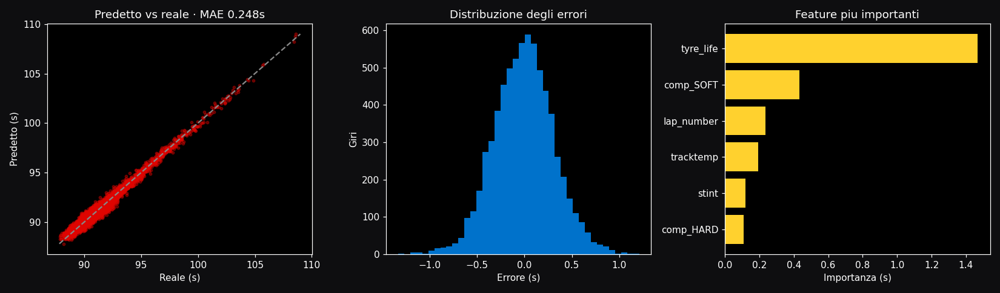

# 🏎️ F1 Strategy & ML

Analisi dati, machine learning e ottimizzazione della strategia di gara in Formula 1,
a partire dalla telemetria ufficiale (FastF1). Nessun video: tutto guidato dai dati.

> 🔴 **Demo live (GitHub Pages):** https://emanuele-clc.github.io/f1-vision-analytics/ — l'ottimizzatore di strategia gira nel browser.


> Vedi [`PLAN.md`](./PLAN.md) per l'architettura e la roadmap del progetto.

## Cosa fa

- 📥 **Data layer** — scarica sessioni reali via FastF1 e le pulisce in DataFrame pronti all'uso.
- 🧪 **Feature engineering** — costruisce dataset per il ML e stima il degrado gomma per mescola.
- 🤖 **Machine learning** — modello di previsione del tempo sul giro (gradient boosting) con cross-validation.
- 🧠 **Strategy optimizer (planning)** — trova la strategia gomme/pit ottimale (soste, mescole, stint),
  con analisi di undercut/overcut.
- 🎲 **Simulazione Monte Carlo** — valuta le strategie sotto incertezza (Safety Car, variabilità di
  degrado e pit-stop) e restituisce distribuzione dei tempi e probabilità di battere le alternative.
- 📻 **Strategia live** — durante la gara ricalcola a ogni giro la decisione (restare fuori / box,
  quando e con quale mescola) dallo stato corrente di gomme e giri.
- 🖥️ **Dashboard** — interfaccia Streamlit: degrado, strategia consigliata, replay.

## Quickstart

```bash
python -m venv .venv && .venv\Scripts\activate    # Windows
pip install -r requirements.txt

# Analisi + strategia ottimale su una gara reale
python scripts/optimize_strategy.py --year 2024 --gp "Monza" --laps 53

# Allena e VALIDA il modello ML dei tempi sul giro
python scripts/train_models.py --synthetic        # offline, nessuna rete
python scripts/train_models.py --year 2024 --gp "Monza"   # con dati reali FastF1

# Dashboard
streamlit run apps/dashboard.py
```

## Risultati del modello ML

Il modello di previsione dei tempi sul giro viene validato in modo rigoroso: confronto
tra piu algoritmi con cross-validation, ricerca degli iperparametri e importanza delle
feature. Su un dataset di una stagione (migliaia di giri):

| Modello | MAE (5-fold CV) |
|---|---|
| Baseline (media) | ~1,31 s |
| Regressione lineare | ~0,78 s |
| Random Forest | ~0,42 s |
| **Gradient Boosting** | **~0,40 s** |

Sul test set il modello finale raggiunge **MAE ~0,29 s** e **R² ~0,96** (+77% sul baseline).
L'importanza delle feature conferma la fisica attesa: eta gomma, poi mescola, carburante
(numero giro) e temperatura pista. Grafici salvati in `reports/`:



> Rigenera i risultati: `python scripts/train_models.py --synthetic --tune` (rapido) o
> `python scripts/train_models.py --synthetic --heavy` (rigoroso: dataset ampio, ricerca
> iperparametri estesa, curva di apprendimento, ensemble — alcuni minuti).

## Struttura

```
src/f1va/
├── data.py         # caricamento sessioni FastF1 + pulizia giri
├── features.py     # dataset ML + tabella degrado gomme
├── models.py       # modello tempi sul giro (scikit-learn) + CV + save/load
├── strategy.py     # simulatore e ottimizzatore di strategia (planning)
├── montecarlo.py   # simulazione sotto incertezza (Safety Car, varianza)
├── outcome.py      # previsione posizione finale / punti
├── replay.py       # ricostruzione posizioni in pista per il replay
└── config.py       # config YAML
apps/dashboard.py   # dashboard Streamlit
scripts/            # CLI: download, train, optimize
tests/              # unit test (strategia + feature)
```

## Come funziona la strategia

Il degrado di ogni mescola è modellato come `tempo_giro = base + degrado * età_gomma`, stimato
per regressione dai dati reali. Il simulatore somma i tempi degli stint più il tempo perso ai box,
e l'ottimizzatore esplora tutte le combinazioni plausibili di soste, mescole e lunghezze
per trovare quella col tempo gara minimo (rispettando la regola delle due mescole).

## Decisione sotto incertezza (Monte Carlo)

Un muretto box non sceglie sul tempo medio ma sul rischio. Il modulo `montecarlo` simula
migliaia di gare campionando **Safety Car**, **variabilità del degrado** e **del pit-stop**,
e per ogni strategia produce la distribuzione dei tempi (media, P10–P90) e la **probabilità
di battere** le alternative. Quando due piani hanno lo stesso tempo atteso, è questa analisi
a dire quale è più robusto.

```bash
python scripts/simulate_race.py --synthetic --laps 53 --sc-prob 0.4
```

Strategia live che evolve giro dopo giro:

```bash
python scripts/live_strategy.py --synthetic --laps 53 --start SOFT
```

> Con dati reali FastF1 e feed di gara, questa è la stessa logica di supporto alle decisioni
> usata sui muretti box. Il progetto è pensato come strumento, non come demo: parametri,
> incertezze e vincoli sono espliciti e sostituibili con quelli reali della propria scuderia.

## Dati

FastF1 fornisce timing e telemetria ufficiali, gratuiti, con cache locale (`.fastf1_cache/`).
Nessun dato proprietario nel repo.

## Licenza

MIT. Dati F1 di proprietà dei rispettivi titolari, usati a fini educativi e non commerciali.
